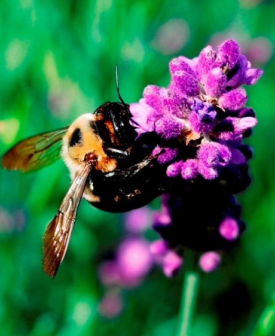
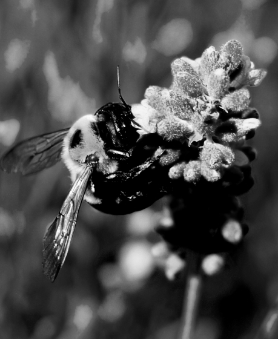

# Image-To-Cartoon

### Statement

In this project, we plan to implementing a application which can help user can load the image and convert it into different Style.
We hope to learn a algorithms to convert from normal image to cartoon or sketch image.

### Analysis
A Image is contributed by milions pixel values. We load every single pixel value which are RGB values. We change the value of RGB
It will help user can convert the image to different type of image (Cartoon, sketch).

### Deliverable and Demonstration
We sucess full to convert from normal Image to the Grey Image.

# Image:
 

# Output
 

### Evaluation of Results
How will you know if you are successful? 
If you include some kind of _quantitative analysis,_ that would be good.

## Architecture Diagram
Upload the architecture diagram you made for your slide presentation to your repository, and include it in-line here.

Create several paragraphs of narrative to explain the pieces and how they interoperate.

## Schedule
Explain how you will go from proposal to finished product. 

There are three deliverable milestones to explicitly define, below.

The nature of deliverables depend on your project, but may include things like processed data ready for import, core algorithms implemented, interface design prototyped, etc. 

You will be expected to turn in code, documentation, and data (as appropriate) at each of these stages.

Write concrete steps for your schedule to move from concept to working system. 

### First Milestone (Sun Apr 9)
Which portion of the work will be completed (and committed to Github) by this day? 

### Second Milestone (Sun Apr 16)
Which portion of the work will be completed (and committed to Github) by this day?  

### Public Presentation (Mon Apr 24, Wed Apr 26, or Fri Apr 28 [your date to be determined later])
What additionally will be completed before the public presentation?

## Group Responsibilities
Here each group member gets a section where they, as an individual, detail what they are responsible for in this project. Each group member writes their own Responsibility section. Include the milestones and final deliverable.

Please use Github properly: each individual must make the edits to this file representing their own section of work.

**Additional instructions for teams of three:** 
* Remember that you must have prior written permission to work in groups of three (specifically, an approved `FP3` team declaration submission).
* The team must nominate a lead. This person is primarily responsible for code integration. This work may be shared, but the team lead has default responsibility.
* The team lead has full partner implementation responsibilities also.
* Identify who is team lead.

In the headings below, replace the silly names and GitHub handles with your actual ones.

### Susan Scheme @susanscheme
will write the....

### Leonard Lambda @lennylambda
will work on...

### Frank Funktions @frankiefunk 
Frank is team lead. Additionally, Frank will work on...   
